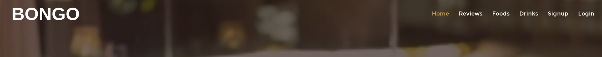
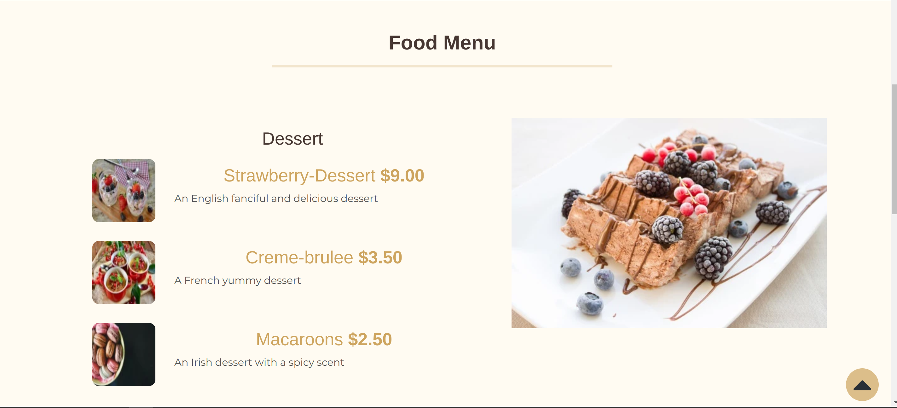
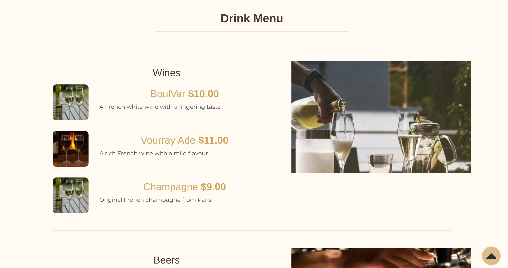

# Bongo Restaurant - Restaurant Management System

**Developer: Dimie Egberipou**

[The live project can be viewed here](https://bongo-man.herokuapp.com/)

## Table of Contents

  - [About](#about)
  - [User Goals](#user-goals)
  - [Site Owner Goals](#site-owner-goals)
  - [User Experience](#user-experience)
  - [User Stories](#user-stories)
  - [Design](#design)
    - [Colours](#colours)
    - [Fonts](#fonts)
    - [Structure](#structure)
      - [Website pages](#website-pages)
      - [Database](#database)
  - [Technologies Used](#technologies-used)
  - [Features](#features)
  - [Validation](#validation)
  - [Testing](#testing)
    - [Manual testing](#manual-testing)
    - [Automated testing](#automated-testing)
    - [Tests on various devices](#tests-on-various-devices)
    - [Browser compatibility](#browser-compatibility)
  - [Bugs](#bugs)
  - [Heroku Deployment](#heroku-deployment)
  - [Credits](#credits)
  - [Acknowledgements](#acknowledgements)

### About

The Bongo Restaurant is a fictional business where users can create an account, update their profiles reserve a table and view the food and drinks menu.

### User Goals

- To create a table reservation
- To be able to view edit and delete reservation
- To view the food and drink menus

### Site Owner Goals

- To provide a solution to allow users to reserve a table online
- To attract more business with a well crafted site
- Provide a modern application with an easy navigation
- Fully responsive and accessible

## User Experience

### Target Audience
- Users that wish to reserve a table for a meal or a party with family and friends
- Past and new customers for the business
- Organize a wedding party reception
- Tourists visiting the area that are looking for a meal or a drink or both
- Fans visiting the area for a sports event or a music concert
- People employed in the area to eat and drink after work

### User Requirements and Expectations

- Fully responsive
- Accessible
- A welcoming design
- Social media

##### Back to [top](#table-of-contents)

## User Stories

### Users

1.	As a User I can navigate across the site so that I can move to each feature of the site easily (Must have)
2.	As a User I can use a navbar, footer, and social icons so that I can navigate the site, access menus, and access socials (Must have)
3.	As a User I can create a booking by selecting a date and time so that I can reserve my table (Must have)
4.	As a User I can update my booking so that I can choose another available time and date (Must have)
5.	As a User I can delete my booking so that I can cancel my table reservation (Must have)
6.	As a user I can view my booking so that I can remind myself of the date and time I have booked (Must have)
7. As a User I can I am notified so that I know my action of creation, edit, or deletion of a booking has been successful (Must have)
8. As a User I can register as prompted so that I can make a booking if I wish reserve a table (Must have)
9. As a User I can register to create an account so that my details are stored for faster booking in future (Must have)
10. As a User I can have a profile so that I can change my username and info about myself(Must have)
11. As a user I can login so that I can book a table (Must have)
12. As a user I can see my login status so that I know if I am logged in or not (Must have)
13. As a User I can view the list of reviews made by customers of various tables (Must have)
14. As a user I can login so that I can give a review (Must have)
15. As a User I can view the food and drink menu so that I can decide wether to eat at the business (Must have)
16. As a User I can not book a date in the past so that my booking is valid (Must have)

17. As a User I can not book a table already booked so that my booking is valid and not double booked (Must have)

### Admin / Authorised User
18.	As an Admin / Authorised User I can log in so that I can access the back end of the site (Must have)

19. As an Admin I can login to add or remove items from the food and drink menu so that we can add more food and drinks or remove them also add and remove tables (Must have)
20.	As a Admin I can create, read, update and delete table,food and drinks items from the database so that we can add, remove, rename and view all our tables, food and drinks items (Must have)
21. As an Admin / Authorised User I can search through bookings so that I can find the information I am looking for	 (Should have)
22. As an Admin / Authorised User I can filter bookings by date so that I can see what bookings we have for a particular day (Should have)

### Site Owner  
23. As a Site Owner I can provide a fully responsive site for my customers so that they have a good user experience (Must have)
24. As a Site Owner I can validate data entered into my site so that all submitted data is correct to avoid errors (Must have)

### User Stories

User Stories

##### Back to [top](#table-of-contents)

## Design

### Colours

Dark themes are popular so I wanted to keep the site on a dark theme and not overly bright.

The colors I wanted to stay close to  [Coolors.co](https://coolors.co/)

See colour pallet

### Fonts

 The fonts selected were from Google Fonts, Montserrat wits sans-serif as a backup font.

### Structure

#### Website pages

The site was designed for the user to be familiar with the layout such as a navigation bar along the top of the pages and a hamburger menu button for smaller screen.

The footer contains all relevant social media links that the business has so the user can visit any social media site and follow the business there to expand the businesses followers, likes and shares.

- The site consists of the following pages:
  - Homepage with cards for the user to choose to reserve a table or review it, view the food or drinks menu.
  - Food menu has the current list of all available foods from the database sorted by snacks, mains and desserts
  - Drinks menu has the current list of all available drinks from the database sorted by type
  - Reserve page allows registered users to reserve a table of given capacity, date time for start of reservation and date time for end of reservation
  - Reservations displays all reservations for the user that they have made, reservations in the past are automatically rejected
  - Edit reservation allows the user to change their date, time
  - Delete reservation allows the user to delete the reservation which will then delete it from the database
  - Reviews has the current list of all reviews made by customers
  - Review allows registered users to make a review
  - Profile allows registered user to view and update their profile details
  - Login / Logout allows users to login to make bookings, view, edit, and delete bookings
  - Register allows the user to regiser so they can use the booking system

  #### Database

- Built with Python and the Django framework with a database of a Postgres for the deployed Heroku version(production)
- Two database model shows all the fields stored in the database

Show diagram

##### User Model
The User Model contains the following:
- user_id
- password
- last_login
- is_superuser
- username
- first_name
- last_name
- email
- is_staff
- is_active
- date_joined

##### Profile Model
The Profile Model contains the following:
- gender
- bio
- address
- avatar
- user (OneToOne Field)

##### Food Model
The Food Model contains the following:
- name
- food_type
- description
- price
- image

##### Drink Model
The Drink Model contains the following:
- name
- drink_type
- description
- price
- image

##### Table Model
The Table Model contains the following:
- title
- table_type
- capacity
- number
- is_available
- description
- slug
- cost
- image

##### Reservation Model
The Reservation Model contains the following:
- reserve_start
- reserve_end
- table (ForeignKey)
- user (ForeignKey)
- resrve_date

##### Review Model
The Review Model contains the following:
- table (ForeignKey)
- author (ForeignKey)
- content
- date_created

## Technologies Used

### Languages & Frameworks

- HTML
- CSS
- Javascript
- Python
- Django

### Libraries & Tools

<!-- - [Am I Responsive](http://ami.responsivedesign.is/) -->
- [Bootstrap v4.2](https://getbootstrap.com/)
- [Bootstrap v5.2](https://getbootstrap.com/)
- [Cloudinary](https://cloudinary.com/)
- [Favicon.io](https://favicon.io)
- [Chrome dev tools](https://developers.google.com/web/tools/chrome-devtools/)
- [Font Awesome](https://fontawesome.com/)
- [Git](https://git-scm.com/)
- [GitHub](https://github.com/)
- [Google Fonts](https://fonts.google.com/)
- [Heroku Platform](https://id.heroku.com/login)
- [jQuery](https://jquery.com)
- [Postgres](https://www.postgresql.org/)
- [django-admin-rangefilter](https://pypi.org/project/django-admin-rangefilter/)
- [django-shortcuts](https://pypi.org/project/django-shortcuts/)
- Validation:
  - [WC3 Validator](https://validator.w3.org/)
  - [Jigsaw W3 Validator](https://jigsaw.w3.org/css-validator/)
  - [JShint](https://jshint.com/)
  - [Pycodestyle(PEP8)](https://pep8ci.herokuapp.com)
  - [Lighthouse](https://developers.google.com/web/tools/lighthouse/)
  - [Wave Validator](https://wave.webaim.org/)

##### Back to [top](#table-of-contents)

## Features

### Home page
- Home page includes nav bar, main body and a footer

See feature images

### Brand & Navigation
- Brand name for the business
- Fully Responsive
- On small screens switches to hamburger menu
- Indicates login/logout in status

See feature images

### Footer
- Contains social media links and copyright
- displayed across all pages

See feature images

### Sign up / Register
- Allow users to register an account
- Username, email and password is required
- Username and email are validate using ajax for a better user experience

See feature images

### Profile
- Allow users to update their profile and update their avatar

See feature images

### Login
- User can login to create a reservation, view reservations, edit and delete reservations

See feature images

### Logout
- Allows the user to securely log out
- Ask user if they are sure they want to log out

See feature images

### Book
- Allows the user to reserve a table using the reservation form
- Messages are displayed if the data is not valid such as a date in the past or a table that is occupied within the time frame of the booking

See feature images

### Reservations
- Allows the user to see all their reservations
- If the booking is older than today it is automatically expired for the user

See feature images

### Edit Reservation
- Allows the user to edit their reservation to another date time

See feature images

### Delete Reservation 
- Allows the user to cancel their booking, asks user are they sure
  

See feature images

### Reviews
- Lists all reviews made by registered users. 
  

See feature images

### Review
- Allows logged in user to make a review to a table using the review form. 
- A message is displayed if the content field is left empty
  

See feature images

### Food Menu
- The food menu displays all available foods on the menu
- Menu is seperated by snacks, mains and desserts
- Items can be added via the admin panel in the backend by admin

  

See feature images

### Drinks
- The drinks menu displays all available foods on the menu
- Menu is seperated by wines, beers and cocktails
- Items can be added via the admin panel in the backend by admin

  

See feature images

### Social Media Links
- A link is used for each social media displayed
- All links open in a new tab to ensure user is not directed away from the business
- Displayed on all pages
  

See feature images

### Pagination
- Pagination is used on the home page and the reviews page
- Ensures the page is kept tidy as only 3 items are displayed per page
  

See feature images

##### Back to [top](#table-of-contents)

## Validation

The W3C Markup Validation Service

Home

Register

Login

Logout

Reservations

Edit Reservation

Delete Reservation

Foods

Drinks

Reviews

Review

Profile

Profile Update

### CSS Validation
The W3C Jigsaw CSS Validation Service

Style.css

### JavaScript Validation
JSHint JS Validation Service

Script.js

### PEP8 Validation
PEP8 Validation was done by using Code Institute CI Python Linter

Tool used: Pycodestyle

Accont App

Admin.py

models.py

urls.py

views.py

signal.py

forms.py

Account Tests

Restaurant

Admin.py

models.py

urls.py

views.py

Restaurant Tests

Home

urls.py

views.py

### Lighthouse

Performance, best practices and SEO was tested using Lighthouse.

#### Desktop

Index

Register

Login

Logout

Food Menu

Drinks Menu

##### Back to [top](#table-of-contents)

## Testing

1. Manual testing
2. Automated testing

### Manual testing
1. As a User I can navigate across the site so that I can move to each feature of the site easily

**Step** | **Expected Result** | **Actual Result**
------------ | ------------ | ------------ |
| Click on the 'Home' link in the navigation bar | Homepage will load| Works as expected |
| Click on the 'Register' link in the navigation bar | Sign up page will load| Works as expected |
| Click on the 'Login' link in the navigation bar | Login page will load| Works as expected |
| Click on the 'Menu' link in the navigation bar, select 'Foods' | Food menu page will load| Works as expected |
| Click on the 'Menu' link in the navigation bar, select 'Drinks' | Drinks menu page will load| Works as expected |
| Click on the 'Reservation' link in the navigation bar | Reservations page will load| Works as expected |
| Click on the 'Reviews' link in the navigation bar | Reviews page will load| Works as expected |
| Click on the 'Logout' link in the navigation bar | Logout page will load| Works as expected |

2. As a User I can use a navbar, footer, and social icons so that I can navigate the site, access menus, and access socials

**Step** | **Expected Result** | **Actual Result**
------------ | ------------ | ------------ |
 | See test 1 | See test 1 | Works as expected |
 | Scroll to footer at bottom of page | find footer | Works as expected |
 | Scroll to footer at bottom of page | find social links | Works as expected |

5. As a User I can create a booking by selecting a date and time so that I can reserve my table

**Step** | **Expected Result** | **Actual Result**
------------ | ------------ | ------------ |
| Click on the 'Book' link button on the home page | Find the booking form on the reservations page | Works as expected |

6. As a User I can update my booking so that I can choose another available time and date

**Step** | **Expected Result** | **Actual Result**
------------ | ------------ | ------------ |
| From 'My Bookings' click 'Edit' on booking to be edited| Find the edit booking form loaded  | Works as expected |

7. As a User I can delete my booking so that I can cancel my table reservation

**Step** | **Expected Result** | **Actual Result**
------------ | ------------ | ------------ |
| From 'Reservations' click 'Delete' on booking to be cancelled| Find the Delete confirm page loaded  | Works as expected |

8. As a user I can view my booking so that I can remind myself of the date and time I have booked

**Step** | **Expected Result** | **Actual Result**
------------ | ------------ | ------------ |
| Click on the 'Reservations' link in the navigation bar | Reservation list will display all bookings made| Works as expected |

9. As an Admin / Authorised User I can log in so that I can access the back end of the site

**Step** | **Expected Result** | **Actual Result**
------------ | ------------ | ------------ |
| Visit the admin page https://ci-pp4-the-diplomat.herokuapp.com/admin/login/?next=/admin/ | Enter admin login credentials, gain access to back end | Works as expected |

12. As an Admin I can login to add or remove items from the food and cocktail menu so that we can add more food and drinks or remove them

**Step** | **Expected Result** | **Actual Result**
------------ | ------------ | ------------ |
| Visit the admin page https://ci-pp4-the-diplomat.herokuapp.com/admin/login/?next=/admin/ | Enter admin login credentials, gain access to back end | Works as expected |
| Click on the Foods on the left panel, select a Add Food | Add food form is displayed | Works as expected |
| Click on the Drinks on the left panel, select a Add Drink | Add drink form is displayed | Works as expected |

<!-- 
 -->

13. As a Admin I can create, read, update and delete food and drinks items from the database so that we can add, remove, rename and view all our food and drinks items

**Step** | **Expected Result** | **Actual Result**
------------ | ------------ | ------------ |
| Visit the admin page https://bongo-man.herokuapp.com/admin/login/?next=/admin/ | Enter admin login credentials, gain access to back end | Works as expected |
| Click on the Foods / Drinks on the left panel, select an item by id | Item Form is displayed allowing, editing and deletion  |Works as expected |

14. As a User I can I am notified so that I know my action of creation, edit, or deletion of a booking has been successful

**Step** | **Expected Result** | **Actual Result**
------------ | ------------ | ------------ |
| From the reservations page, create a reservation | A message will be displayed upon completion, Javascript makes it disappear after 3 seconds | Works as expected |
| From the reservations list page, edit a reservation | A message will be displayed upon completion, Javascript makes it disappear after 3 seconds | Works as expected |
| From the reservations list page, delete a booking | A message will be displayed upon completion, Javascript makes it disappear after 3 seconds | Works as expected |

18. As a user I can see my login status so that I know if I am logged in or not

**Step** | **Expected Result** | **Actual Result**
------------ | ------------ | ------------ |
| While logged in, view navigation bar | Logout button should be visible | Works as expected |

21. As an Admin / Authorised User I can filter reservations by date so that I can see what reservations we have for a particular day

**Step** | **Expected Result** | **Actual Result**
------------ | ------------ | ------------ |
| From the admin panel, select Bookings | Find  filters on displayed right panel of page | Works as expected |

### Automated testing

- Testing was done using the built in Django module, unittest.
- Coverage was also usesd to generate a report

<!-- 

Bar & Grill App, test_models.py

Bar & Grill App, test_views.py

Bar & Grill App, test_urls.py

 -->

Rms, Coverage

Account, Coverage

Restaurant app, Coverage

Bookings App, test_views.py

Bookings App, test_urls.py

Bookings App, Coverage

### Device Testing & Browser compatibility

The site uses to test on various real world devices was [BrowserStack](https://bongo-man.herokuapp.com/)  

This allowed me to test on real devices and not just device emulators.

The following devices were used to test my site:

Samsung Galaxy S22 Ultra

Apple iPhone 13

Google Pixel 5

Mozilla Firefox (v105 latest)

Google Chrome (v106 latest)

Safari (Monteray v15.3 latest)

##### Back to [top](#table-of-contents)

## Bugs

| **Bug** | **Fix** |
| ------- | ------- |
| css not loading| the css folder was created in uppercase as CSS, renamed and fixed |
| While logged in as a user, on edit bookings page, if you changed the url booking number and if the number was a valid booking for another user it would access the booking | Defensive programming to make sure that only bookings made by the user would be visible |
| Double bookings | Adjusted code to check that the date, time and table were unique together and to give an error to indicate to the user that the booking was unavailable for that date, time and table combination |
| Food item description not showing on menu | A "p" element was used to encase the jinja code, once removed the food item description was then visible |
| Foods not listing by type, starters, manins and desserts | I needed to fix the database loop for the food items to specify the food type had to be a starter to display in the starter section of the menu, and the same for mains and desserts |
| Drinks not listing by type, wines, beers and cocktails | I needed to fix the database loop for the drinks item to specify the drink type had to be a wine to display in the wine section of the menu, and the same for beers and cocktails |
| Card links not working on home page for book a table, food menu and drinks menu | The links were not set within urls.py so just needed to be wired up to load each relevant page |
| Search field in admin using username returning error:Related field got invalid lookup:icontains | I changed the search_fields tuple to 'customer__username |

##### Back to [top](#table-of-contents)

### Heroku Deployment

[Official Page](https://devcenter.heroku.com/articles/git) (Ctrl + click)

This application has been deployed from Github using Heroku. Here's how:

1. Create an account at heroku.com

2. Create an app, give it a name for such as bongo, and select a region

3. Under resources search for postgres, and add a Postgres database to the app

Heroku Postgres

1. Note the DATABASE_URL, this can be set as an environment variable in Heroku and your local deployment(env.py)

2. Install the plugins dj-database-url and psycopg2-binary.

3. Run pip3 freeze > requirements.txt so both are added to the requirements.txt file

4. Create a Procfile with the text: web: gunicorn the_diplomat.wsgi

5. In the settings.py ensure the connection is to the Heroku postgres database, no indentation if you are not using a seperate test database.
I store mine in env.py

6. Ensure debug is set to false in the settings.py file

7. Add localhost, and bongo-man.herokuapp.com to the ALLOWED_HOSTS variable in settings.py

8. Run "python3 manage.py showmigrations" to check the status of the migrations

9. Run "python3 manage.py migrate" to migrate the database

10. Run "python3 manage.py createsuperuser" to create a super/admin user

13. Install gunicorn and add it to the requirements.txt file using the command pip3 freeze > requirements.txt

14. Disable collectstatic in Heroku before any code is pushed using the command heroku config:set DISABLE_COLLECTSTATIC=1 -a ci-pp4-the-diplomat

15. Ensure the following environment variables are set in Heroku

16. Connect the app to GitHub, and enable automatic deploys from main if you wish

17. Click deploy to deploy your application to Heroku for the first time

18. Click on the link provided to access the application

19. If you encounter any issues accessing the build logs is a good way to troubleshoot the issue

### Fork Repository
To fork the repository by following these steps:
1. Go to the GitHub repository
2. Click on Fork button in upper right hand corner

### Clone Repository
You can clone the repository by following these steps:
1. Go to the GitHub repository 
2. Locate the Code button above the list of files and click it 
3. Select if you prefere to clone using HTTPS, SSH, or Github CLI and click the copy button to copy the URL to your clipboard
4. Open Git Bash
5. Change the current working directory to the one where you want the cloned directory
6. Type git clone and paste the URL from the clipboard ($ git clone https://github.com/YOUR-USERNAME/YOUR-REPOSITORY)
7.Press Enter to create your local clone.

##### Back to [top](#table-of-contents)

## Credits

### Images

Images used were sourced from Pexels.com

### Code

Bootstrap dark navigation theme was used alongside boostrap classes and carousel

##### Back to [top](#table-of-contents)

## Acknowledgements

### Special thanks to the following:
- Code Institute
- My Mentor Jack Wachira
- 